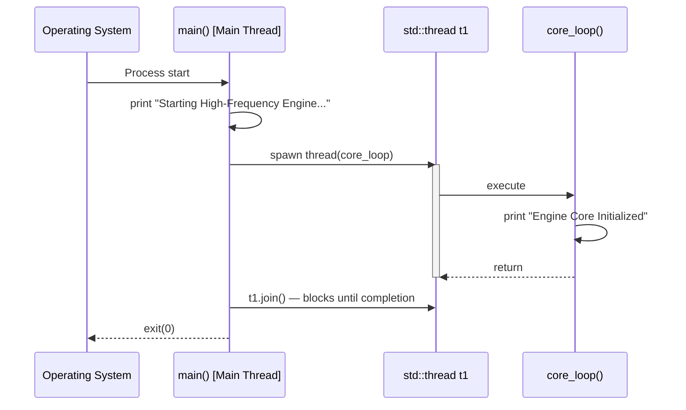
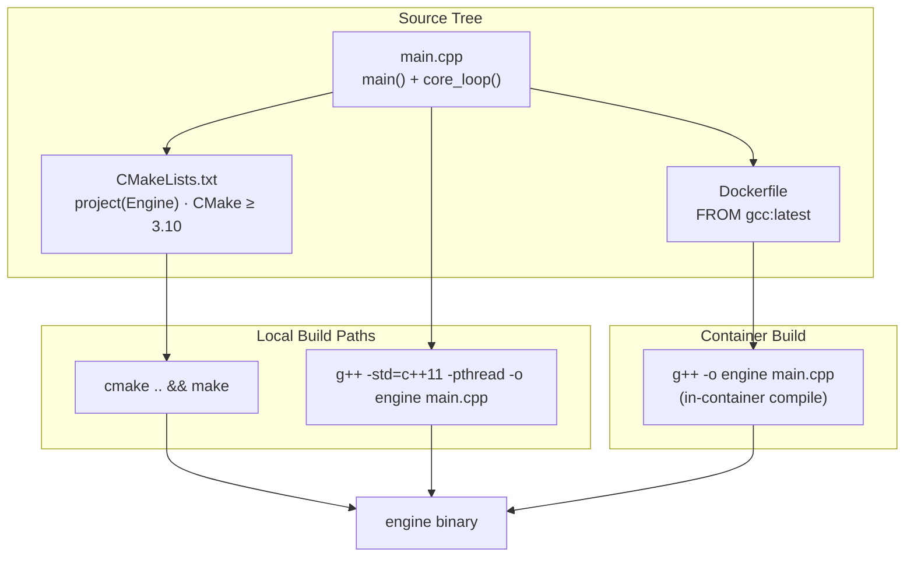
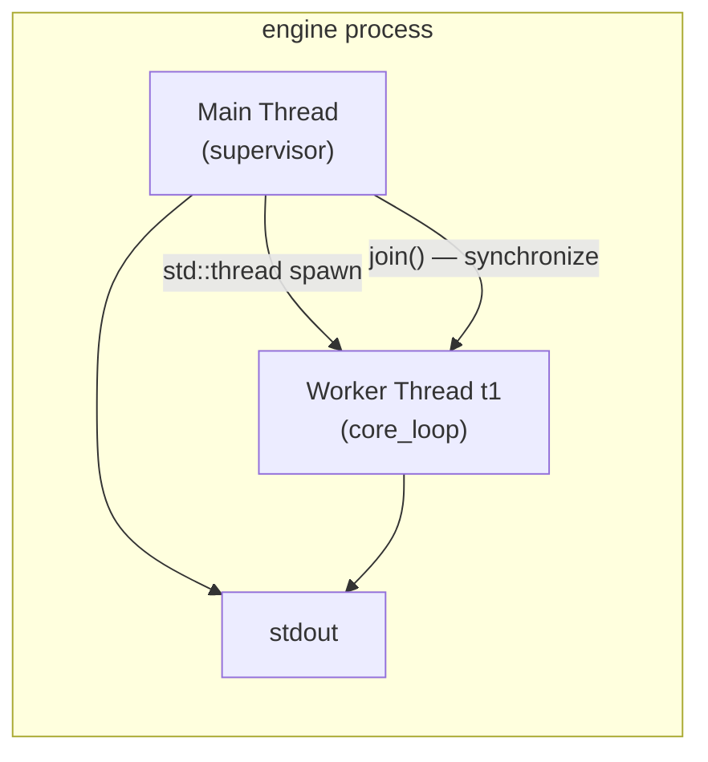

# game-multiplayer-state-sync


> A lightweight C++ engine core designed as the foundation for high-frequency multiplayer game state synchronization. Built with CMake, fully containerized with Docker, and structured around a threaded execution model.

## 🚀 Overview

**game-multiplayer-state-sync** is a C++ application that boots an engine core on a dedicated worker thread. The executable initializes, launches a threaded core loop, and cleanly joins the thread before shutdown. The project ships with a complete build toolchain — CMake for local builds and a Docker image for reproducible, platform-independent execution on any laptop or server.

The architecture is intentionally modular at the entry-point level: `main()` acts as the process supervisor, while `core_loop()` is the isolated execution context where engine logic runs — the natural extension point for tick scheduling, state serialization, and network synchronization.

## 📁 Repository Structure

```
.
├── main.cpp          # Entry point + threaded engine core
├── CMakeLists.txt    # CMake build configuration (≥ 3.10)
├── Dockerfile        # Containerized build & runtime (gcc:latest)
├── .gitignore        # Excludes secrets, credentials, and build artifacts
├── LICENSE           # VisionQuantech Custom Commercial License
└── README.md         # This file
```

## ⚙️ Architecture — How It Works

The application consists of a single translation unit (`main.cpp`) with two clearly separated responsibilities:

### 1. Process Supervisor — `main()`

- Prints the startup banner: `Starting High-Frequency Engine...`
- Instantiates a `std::thread` (`t1`) bound to `core_loop()`.
- Calls `t1.join()`, blocking the main thread until the worker completes.
- Returns exit code `0` on clean shutdown.

### 2. Engine Core — `core_loop()`

- Executes on its own dedicated thread, decoupled from the main thread's lifecycle.
- Emits the initialization signal: `Engine Core Initialized`.
- Hosts the engine's execution context — the designated location for the high-frequency simulation loop, state serialization, and synchronization logic.

### 3. Threading Model

Concurrency is built on the C++ Standard Library (`<thread>`), requiring no external dependencies. The main thread supervises; the worker thread executes. `join()` guarantees deterministic, race-free shutdown.

### Execution Flow



### Component & Build Architecture



### Threading & Data Flow



## 🐳 Running with Docker

Docker provides a zero-dependency way to build and run the engine identically on any laptop or server.

### Build the image

```bash
docker build -t game-multiplayer-state-sync .
```

### Run the container

```bash
docker run --rm game-multiplayer-state-sync
```

Expected output:

```
Starting High-Frequency Engine...
Engine Core Initialized
```

### Using docker-compose

Create a `docker-compose.yml` in the repository root:

```yaml
services:
  engine:
    build: .
```

Then run:

```bash
docker-compose up --build
```

> The engine is a short-lived CLI process rather than a long-running server, so no port mappings are required.

## 🛠️ Building Locally (Without Docker)

### Option A: CMake

```bash
mkdir build && cd build
cmake ..
make
./engine
```

### Option B: Direct g++ compilation

```bash
g++ -std=c++11 -pthread -o engine main.cpp
./engine
```

**Requirements:** a C++11-capable compiler (`g++` or `clang++`) and, for Option A, CMake ≥ 3.10. The `-pthread` flag is required for direct compilation due to the use of `std::thread`.

## 📄 License

Distributed under the **VisionQuantech Custom Commercial License** (see `LICENSE`):

- **Non-financial / educational use:** free.
- **Personal revenue-generating use:** 15–30% gross revenue share.
- **Business / enterprise use:** requires a separate commercial license — contact **visionquantech@proton.me**.

---

*Copyright © 2026 Shivay00001 / VisionQuantech*