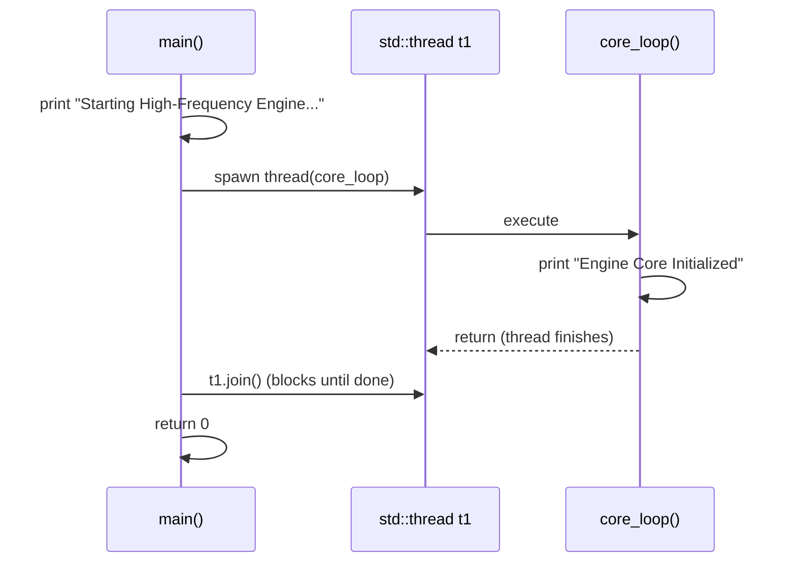
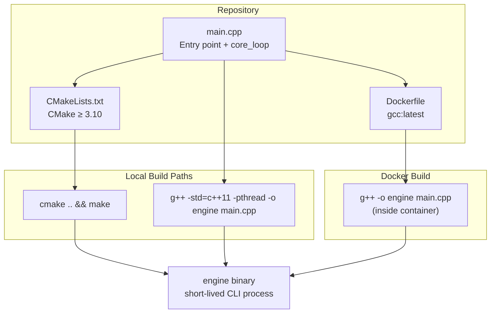
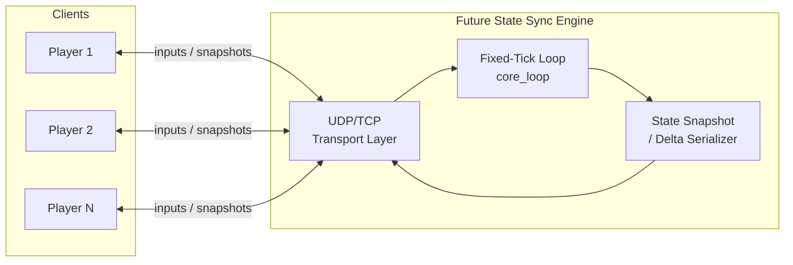

# game-multiplayer-state-sync


> A minimal C++ engine skeleton intended as the foundation for a high-frequency multiplayer game state synchronization engine. Currently in early prototype stage — see the **Workability Assessment** section for an honest evaluation.

## 🚀 Overview

This repository contains a bare-bones C++ application that initializes a threaded "engine core" loop. It is designed to be built via **CMake** or a raw `g++` invocation, and is fully containerized via **Docker** so it can run identically on any laptop or server.

The long-term goal (implied by the repository name) is a multiplayer game state synchronization engine; the current codebase provides only the executable skeleton, build system, and containerization scaffolding for that vision.

## 📁 Repository Structure

```
.
├── main.cpp          # Entry point: spawns a thread running core_loop()
├── CMakeLists.txt    # CMake build configuration (requires CMake ≥ 3.10)
├── Dockerfile        # Containerized build & run (gcc:latest base image)
├── .gitignore        # Excludes secrets, build artifacts, venvs, and OS files
└── LICENSE           # VisionQuantech Custom Commercial License
```

## ⚙️ Architecture — How It Works

The current implementation is deliberately minimal and consists of a single translation unit (`main.cpp`):

1. **Entry Point (`main`)**
   - Prints `"Starting High-Frequency Engine..."` to stdout.
   - Spawns a single `std::thread` (`t1`) that executes `core_loop()`.
   - Blocks on `t1.join()` until the worker thread completes, then exits with status `0`.

2. **Core Loop (`core_loop`)**
   - Prints `"Engine Core Initialized"`.
   - Contains a comment placeholder (`// Simulation of high-frequency loop`) where the actual tick loop, state serialization, and network synchronization logic are intended to live.

3. **Threading Model**
   - Uses the C++ standard library `<thread>` for concurrency. There is currently a **single worker thread** joined synchronously — no thread pool, no tick scheduler, no lock-free state buffers yet.

4. **Build System**
   - **CMake** (`CMakeLists.txt`): defines project `Engine`, producing an executable named `engine` from `main.cpp`. Minimum CMake version: 3.10.
   - **Docker**: single-stage build using `gcc:latest`, compiling directly with `g++ -o engine main.cpp` (bypassing CMake inside the container) and setting `CMD ["./engine"]`.

### Execution Flow



### Component & Build Architecture



### Intended Future Direction (Aspirational)



> **Note:** The diagram above represents the design goal implied by the repository name. **None of the networking, tick scheduling, or state replication components exist in the current code.**

## 🐳 Running with Docker (Recommended)

Docker is the simplest way to run this on any laptop or server with zero local toolchain requirements.

### Build the image

```bash
docker build -t game-multiplayer-state-sync .
```

### Run the container

```bash
docker run --rm game-multiplayer-state-sync
```

Expected output:

```
Starting High-Frequency Engine...
Engine Core Initialized
```

### Using docker-compose

No `docker-compose.yml` is included in this repository, so `docker-compose up` will **not** work out of the box. To enable it, create a `docker-compose.yml` in the repository root:

```yaml
services:
  engine:
    build: .
```

Then run:

```bash
docker-compose up --build
```

> **Note:** The program is a short-lived CLI process (not a server listening on a port), so port mappings like `-p 8080:8080` are unnecessary at this stage.

## 🛠️ Building Locally (Without Docker)

### Option A: CMake

```bash
mkdir build && cd build
cmake ..
make
./engine
```

### Option B: Direct g++ compilation

```bash
g++ -std=c++11 -pthread -o engine main.cpp
./engine
```

**Requirements:** A C++ compiler with C++11 (or later) support (`g++`, `clang++`) and, for Option A, CMake ≥ 3.10. The `-pthread` flag is required when compiling directly due to the use of `std::thread`.

## ✅ Workability Assessment

**Honest verdict: this repository is an early-stage skeleton, NOT production-ready.**

**What works:**
- ✅ The code compiles cleanly and executes correctly — output is deterministic.
- ✅ The Dockerfile is valid, minimal, and produces a working container.
- ✅ The CMake configuration is correct for the single-file project.
- ✅ `.gitignore` properly excludes secrets, credentials, and build artifacts.

**What is missing / problematic:**
- ❌ **No multiplayer functionality exists.** Despite the repository name, there is no networking (no sockets, no UDP/TCP), no state synchronization, no serialization, no client/server architecture, and no game loop with a fixed tick rate.
- ❌ **The "high-frequency loop" is a stub.** `core_loop()` prints one line and returns; the thread exits immediately.
- ❌ **No tests, no CI, no linting configuration.**
- ❌ **Threading is trivial** — one thread, immediately joined; no concurrency architecture (no tick scheduler, message queues, or state buffers).
- ❌ **Dockerfile bypasses CMake** (`g++` invoked directly), which will not scale as source files are added — the build should eventually use `cmake --build` inside the container.
- ❌ **The program is not a server** — it runs and exits in milliseconds, so typical deployment patterns (port exposure, health checks, restart policies) don't apply yet.

**Bottom line:** Treat this as a scaffold. It is a clean, buildable starting point, but realizing actual multiplayer state synchronization requires implementing the networking layer, tick loop, and state replication logic from scratch.

## 📄 License

This project is distributed under the **VisionQuantech Custom Commercial License** (see `LICENSE`):

- **Non-financial / educational use:** free.
- **Personal revenue-generating use:** 15–30% gross revenue share.
- **Business / enterprise use:** requires a separate commercial license — contact **visionquantech@proton.me**.

---

*Copyright © 2026 Shivay00001 / VisionQuantech*